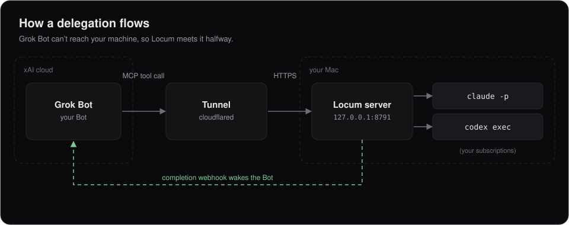
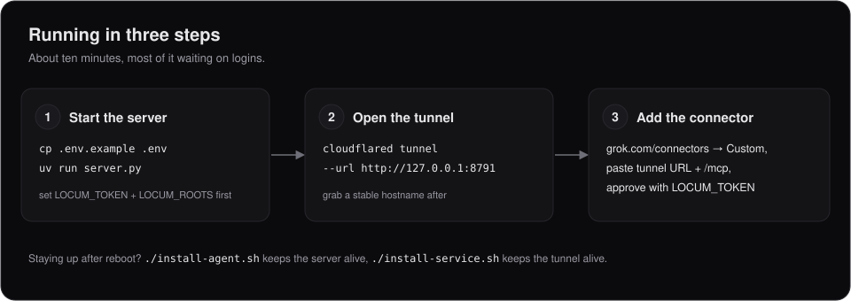
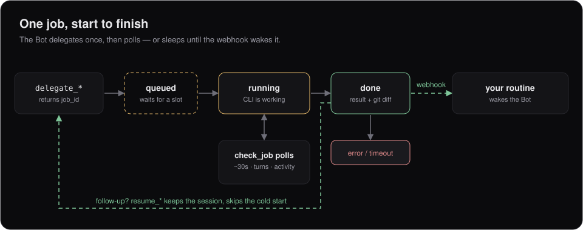

# Locum

[](https://github.com/HarjjotSinghh/locum/actions/workflows/ci.yml)
[](LICENSE)
[](https://www.python.org/)

*A locum is a qualified professional who temporarily does someone else's job.*

Grok Bot is a good chatbot and an expensive coder. Locum lets it hand real coding work to the Claude Code and Codex CLIs already logged in on your machine, instead of burning its own usage grinding through your repo itself.

Grok Bot lives in xAI's cloud, so it can't see `localhost`. It reaches Locum over a tunnel, as a custom MCP connector — a documented Grok feature, not a hack.



Not affiliated with xAI, Anysphere, OpenAI, or Anthropic.

## The rules

This only works because it's *your* machine, *your* subscriptions, *your* work. [Anthropic's legal page](https://code.claude.com/docs/en/legal-and-compliance) says Pro/Max plans assume ordinary individual use, and forbids routing other people's requests through your plan's credentials.

| | |
|---|---|
| ✅ | You, your machine, your subscription, your own work |
| ❌ | Letting other people's requests hit your subscription |
| ⚠️ | Sharing this code so others run it on their own setup — fine, as long as the rules below hold |

Four invariants. They never come out:

1. Never touch credential files, keychains, or OAuth tokens.
2. Never call `api.anthropic.com` / `api.openai.com` directly.
3. Only spawn the official `claude` / `codex` binaries, logged in by you.
4. Single operator: one token, one list of allowed folders.

Anything that breaks one of these is the wrong feature.

## Setup

You need `claude` and `codex` already signed in, plus [uv](https://docs.astral.sh/uv/).



**1. Start the server.**

```bash
cp .env.example .env   # set LOCUM_TOKEN and LOCUM_ROOTS
set -a && source .env && set +a
uv run server.py
```

**2. Open the tunnel.**

```bash
brew install cloudflared
cloudflared tunnel --url http://127.0.0.1:8791
```

Quick tunnels get a new URL on every restart, and Grok stores the URL — fine for a first try, annoying forever. For a stable hostname (needs a domain on your Cloudflare account):

```bash
cloudflared tunnel login
./setup-tunnel.sh locum.example.com
cloudflared tunnel run locum
```

**3. Add the connector.** In Grok: Connectors → New Connector → Custom, with your tunnel URL plus `/mcp`.

Grok only speaks OAuth 2.1 for custom connectors, so Locum ships its own tiny authorization server — nothing to register anywhere. It usually self-configures; if Grok shows a manual form instead:

| Field | Value |
|---|---|
| Client ID | anything, e.g. `locum` |
| Client Secret | leave empty |
| Authorization Endpoint | `https://<tunnel>/authorize` |
| Token Endpoint | `https://<tunnel>/token` |
| Scopes | `mcp` |
| Token Auth Method | `none (PKCE only)` |

You'll get a consent screen showing where you're redirecting (check it says `grok.com`) and asking for a passphrase — that's your `LOCUM_TOKEN`. This gate matters: `/authorize` sits on a public tunnel, and without it anyone with the URL could mint a token and run commands on your machine.

### Staying up after a reboot

Two scripts, two jobs:

```bash
sudo ./install-service.sh   # keeps the tunnel up (don't use `cloudflared service install` — it writes a broken plist)
./install-agent.sh          # keeps the server up; no sudo, it must run as you
```

Two macOS gotchas that fail confusingly:

- If the checkout is under Documents/Desktop/Downloads, give **Full Disk Access to `uv`**. Launchd agents don't inherit your terminal's permissions.
- Run `claude setup-token` and save it as `CLAUDE_CODE_OAUTH_TOKEN` in `.env`. Without it, delegation fails with "OAuth session expired" even though the server starts fine.

### Make the Bot actually use it

A connector only makes the tools *available*. If you don't tell the Bot to prefer them, it keeps doing the work itself and you save nothing.

**Bot description (this is the one that matters).** New Bot → Edit Profile → Description, and paste something like:

```
You have the `locum` connector, which delegates work to the operator's own
machine.

Any task touching a real repository (multi-file edits, refactors, debugging,
running tests, reading a codebase) must go to delegate_to_claude rather than
being done yourself.

Call status first: it shows the allowed roots, which CLIs are present, and
whether a slot is free.

delegate_to_claude returns a job_id immediately. Poll check_job about every 30s
and report recent_activity so progress is visible. Never re-delegate a job that
is still queued or running. For follow-ups on the same work use resume_claude
with the session_id, never a fresh delegation (resume_codex for Codex jobs).

cwd must be an absolute path inside an allowed root.
```

**Skill (nice to have).** `SKILL.md` teaches good delegation prompts. Ask a Bot to save it as a skill called `delegate-to-locum`, then enable it under Settings → Plugins → Yours.

## How a job runs



Everything is async — a coding task takes far longer than an MCP call can wait. `delegate_*` hands back a `job_id` immediately; the job sits in `queued` until a slot frees, then runs. The Bot checks `check_job` every ~30s for status, turns, and recent activity — or skips polling entirely: set `LOCUM_COMPLETION_WEBHOOK` and Locum pings your routine once when the job finishes. Follow-ups go through `resume_claude` / `resume_codex` with the old `session_id`, never a fresh delegation.

## Tools

| Tool | Purpose |
|---|---|
| `delegate_to_claude(prompt, cwd, model?, effort?)` | Start a Claude Code job. Returns `job_id` immediately. |
| `resume_claude(session_id, prompt, cwd?, model?, effort?)` | Continue a session. Reuses the prompt cache — always prefer for follow-ups. |
| `delegate_to_codex(prompt, cwd, model?, effort?)` | Same contract, via Codex CLI. |
| `resume_codex(session_id, prompt, cwd?, model?, effort?)` | Continue a Codex session. Fails loudly if Codex reports back a different thread. |
| `check_job(job_id)` | Poll. Returns status, queue position, turns, activity, result — plus `git_changes` when `cwd` is a repo. |
| `list_jobs(limit?, status?)` | Recent jobs, newest first. Confirms work really ran, recovers a lost `job_id`, finds a `session_id` to resume. |
| `cancel_job(job_id)` | Kill a runaway job. |
| `status()` | Roots, CLIs on PATH, running/queued counts, free slots, budget use. Call before delegating. |

`effort` is one vocabulary across both CLIs (`low` / `medium` / `high` / `max`; Codex maps `max` onto `high`). `model` passes straight through. Both cost real quota, so raise them on purpose, not by habit.

## Dashboard

`https://your-host/dashboard` shows every session — prompt, model, transcript, tokens, cost — with running jobs streaming live. Sign in with `LOCUM_TOKEN`; there is no second secret. History and session IDs survive restarts; transcripts don't.

It's a control surface too: filter the list by status, copy a session id for `resume_*`, or cancel a queued or running job from its detail pane (with a confirm — there's no undo).

The server also narrates jobs on stdout. Under launchd: `tail -f ~/Library/Logs/locum/server.out.log | grep -v 'INFO:'`. Set `LOCUM_NARRATE=0` for quiet, and truncate the log now and then — it doesn't rotate.

## Safety

Delegated jobs run autonomously (`LOCUM_AUTONOMY=bypass`): nobody is at the keyboard, so an approval prompt wouldn't pause the job, it would hang it until timeout. That means the agent can run anything as you — `LOCUM_ROOTS` only controls where the job *starts*.

What protects you, in order: your `LOCUM_TOKEN`, narrow `LOCUM_ROOTS`, and running this only for yourself. `LOCUM_AUTONOMY=ask` restores prompting, but Grok Bot can't answer prompts, so jobs will hang.

None of that limits spend, so there are caps: `LOCUM_MAX_COST_USD` and `LOCUM_MAX_JOBS_PER_DAY`, each measured over the trailing 24h and each disabled when unset. Tripping one refuses new delegations with a clear error, and `status` shows use so far. Cost only counts reported spend (Codex reports none), so set the job cap too if Codex matters to you.

## Tests

```bash
python3 test_oauth.py                                      # auth flow, 13 checks
uv run --with fastmcp --with uvicorn python3 test_jobs.py # jobs, 125 checks
```

Neither needs `claude` installed.

## Troubleshooting

Start here: `uv run server.py --doctor` checks the common stuff (token, roots, CLIs, port, journal) and exits nonzero with FAIL lines.

**Everything 404s, even `/health`.** Port collision — something else owns the port. (The Grok Bot desktop app squats on `[::1]:8787`, which is why the default is 8791.) Check:

```bash
lsof -nPw -iTCP:<port> -sTCP:LISTEN
curl -s http://127.0.0.1:<port>/health   # locum answers {"ok": true}
```

**Jobs fail with "OAuth session expired".** First run `claude -p "reply with OK"` yourself — if that fails, just `claude /login`. If it works standalone but not through Locum, the server was started inside a Claude Code session; restart it from a normal terminal.

**Cloudflare 403, error 1010.** Cloudflare blocks Python's default User-Agent. Anything calling the tunnel from Python needs `headers={"User-Agent": "something/1.0"}`. MCP clients are unaffected.

## Honest limits

- Cuts Grok Bot usage, doesn't zero it. The win is ~50 Bot steps becoming one delegation plus a few polls.
- Your machine has to be awake with the tunnel up.
- Cold starts re-pay ~18k tokens of setup. Resume instead.

## Project

- [How it works](https://www.harjotrana.com/blog/locum-grok-bot-provider-adapter), the architecture writeup
- [CONTRIBUTING.md](CONTRIBUTING.md), development setup and the four invariants
- [SECURITY.md](SECURITY.md), threat model and how to report a vulnerability
- [CHANGELOG.md](CHANGELOG.md)

Licensed under [Apache 2.0](LICENSE).
